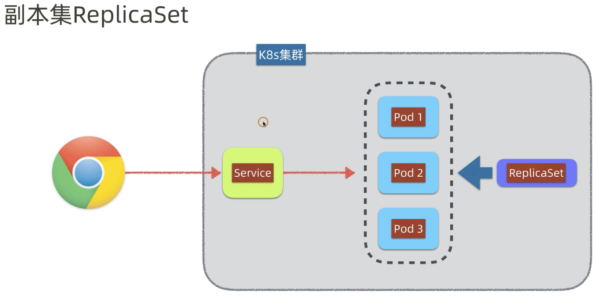
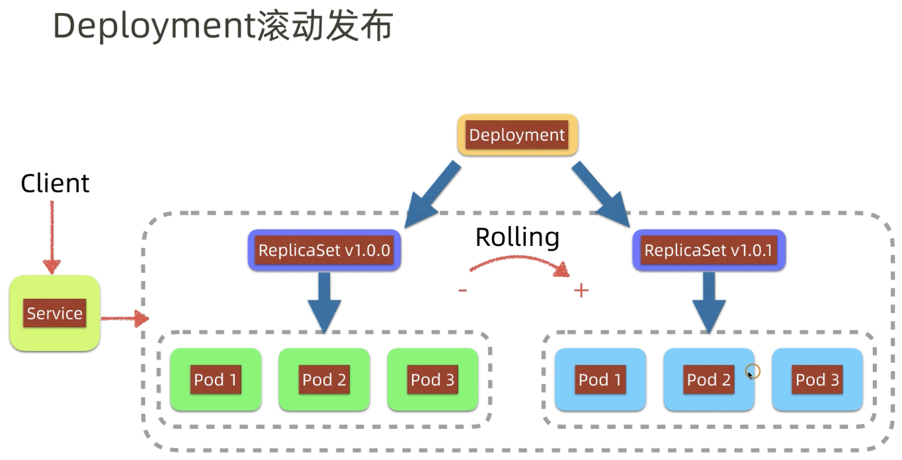
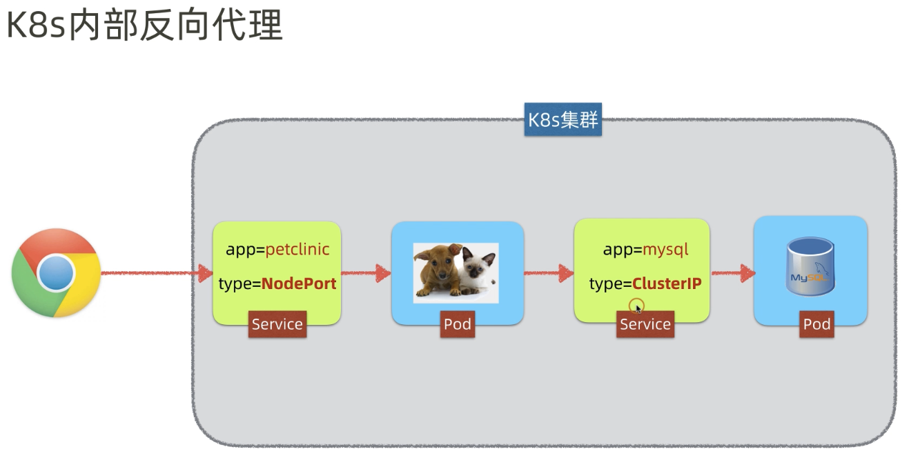
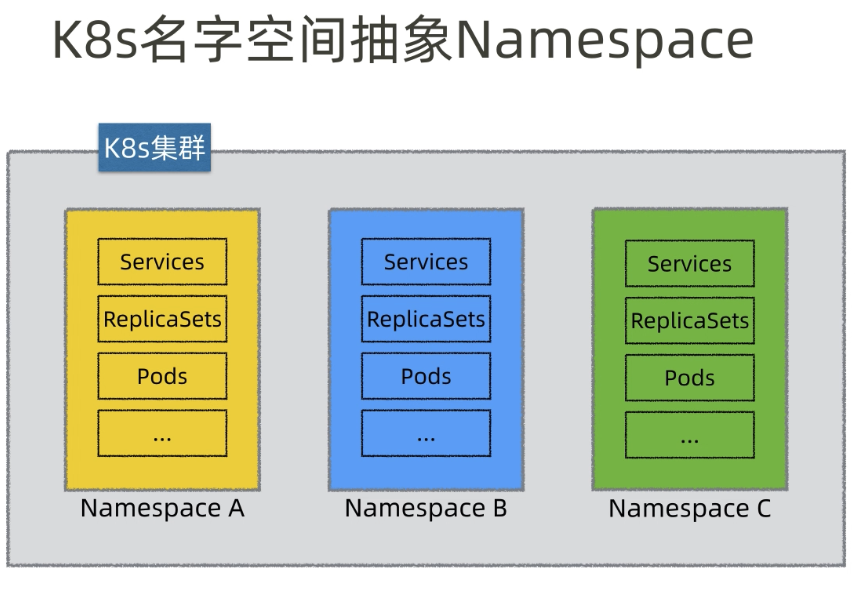
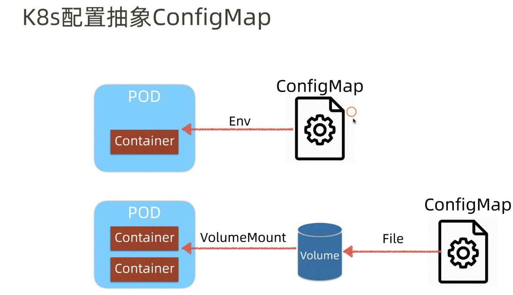

# K8s

==Important: 默认情况下，Pod 只能通过 Kubernetes 集群中的内部 IP 地址访问。 要使得 `hello-node` 容器可以从 Kubernetes 虚拟网络的外部访问，你必须将 Pod 暴露为 Kubernetes [**Service**](https://kubernetes.io/zh-cn/docs/concepts/services-networking/service/)。==

`minikube service [service-name]`

## Big picture of K8s


## Master node in K8s


* etcd: distributed kv strorage, use Raft.

* API server: Interact with cluster.

* Scheduler: scheduling and decision making.

* Controller Manager: guarantee the eventual consistency of status.

## Worker in K8s


* kubelet: resource controller of worker.
* container runtime: controller of container.
* kube-proxy: manage the service.

## Process of K8s


## Framework of K8s


## Pod

* Example

  ```yaml
  # ett-pod.yaml
  apiVersion: v1
  kind: Pod
  metadata:
    name: ett
  spec:
    containers:
    - name: ett
      image: zzheng2020/ett-web-framework
  ```
  
* Common-used commands to publish a pod

  ```shell
  # Get all nodes information
  $ kubectl get all
  
  # Apply a configuration to an object by filename or stdin.
  $ kubectl apply -f [ett.yaml]
  
  # Get a specific pod information
  $ kubectl get pod [pot_name]
  
  # Get a detailed description
  $ kubectl describe pod ett
  ```

  For testing, we can use `$ kubectl port-forward ett 8080:9999` to forward the requests.

  

## NodePort Service


* `port:` exposes the Kubernetes service on the specified port within the cluster.
* `targetPort:` app in container is running on this port.
* `nodePort:` we can externally access to the service.

```yaml
# ett-service.yaml
apiVersion: v1
kind: Service
metadata:
  name: ett
spec:
  ports:
    - name: http
      port: 8080
      targetPort: 9999
      nodePort: 31080
  selector:
    app: ett
  type: NodePort
```

* We can use `kubectl apply -f .` to publish all file under this file path.
* ==Note: use `minikube service ett` to access the app on Chrome.== [Minikube Doc - Accessing apps](https://minikube.sigs.k8s.io/docs/handbook/accessing/)

## Blue/Green Deployment

1. Create two/several versions of app, and push them to docker hub.

2. Specific the app’s version in the `.yaml` file.

   ```yaml
   # ett-pod-v1.0.1.yaml
   apiVersion: v1
   kind: Pod
   metadata:
     name: ett-v1.0.1
     labels:
       app: ett
       version: v1.0.1 # specific the app's version.
   spec:
     containers:
       - name: ett
         image: zzheng2020/ett-web-framework:v1.0.1
   ```

3. Create an `.yaml` file, such as the following example.

   ```yaml
   # ett-service.yaml
   apiVersion: v1
   kind: Service
   metadata:
     name: ett
   spec:
     ports:
       - name: http
         port: 8080
         targetPort: 9999
         nodePort: 31080
     selector:
       app: ett
       version: v1.0.1 # change version to achieve blue/green deployment.
     type: NodePort
   ```

4. Change the version in the `.yaml` to achieve blue/green deployment.

## ReplicaSet



Use `ReplicaSet` to achieve High Availability.

An example is as follows.

```yaml
# ett-replicaset.yaml
apiVersion: apps/v1
kind: ReplicaSet
metadata:
  name: ett
spec:
  replicas: 3
  selector:
    matchLabels:
      app: ett
  template:
    metadata:
      labels:
        app: ett
    spec:
      containers:
        - name: ett
          image: zzheng2020/ett-web-framework:latest
```

## Rolling Update



An example is as follows.

```yaml
# ett-deployment.yaml
apiVersion: apps/v1
kind: Deployment
metadata:
  name: ett
spec:
  selector:
    matchLabels:
      app: ett
  minReadySeconds: 10
  replicas: 3
  template:
    metadata:
      labels:
        app: ett
    spec:
      containers:
      - name: ett
        image: zzheng2020/ett-web-framework:v1.0.1 # change version to achieve rolling updates.
```

```yaml

```

Use `kubectl rollout history deployment/ett` to check rollout history.

Use `kubectl rollout undo deployment/ett` to rollback to the previous version.

Use `kubectl rollout status deployment/ett` to check the status of deployment. Rollback can specify the certain version by using flag `--to-revision=[certain_version_number]`

## ClusterIP Service

Communication between pods.



```yaml
# mysql-pod.yaml
apiVersion: v1
kind: Pod
metadata:
  name: mysql
  labels:
    app: mysql
spec:
  containers:
    - name: mysql
      image: mysql:5.7
      env:
        - name: MYSQL_ROOT_PASSWORD
          value: petclinic
        - name: MYSQL_DATABASE
          value: petclinic
```

```yaml
# mysql-service.yaml
apiVersion: v1
kind: Service
metadata:
  name: mysql
spec:
  selector:
    app: mysql
  ports:
    - name: tcp
      port: 3306
      targetPort: 3306
  type: ClusterIP
```

* `ClusterIP` 内部服务访问
* `NodePort` 对外暴露服务
* `LoadBalancer` 对外暴露服务（公有云）

## Namespace and Kube-DNS



K8s 中用 kube-dns 来解析服务名，实现 K8s 内部域名 到 ClusterID 转换的过程.

## ConfigMap/Screte

